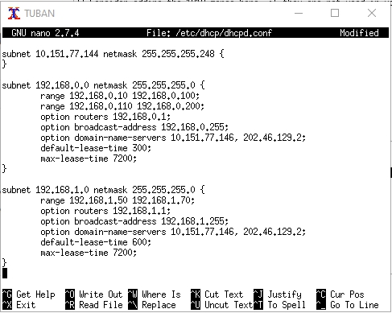

# Lapres Jarkom - Modul 2 - T12
## Oleh
- Mohammad Ifaizul Hasan – 05311840000029
- Anggada Putra Nagamas – 05311840000025

## Teknis Pengerjaan
1. Default memori UML adalah 64M, kecuali :
- SURABAYA : 256M
- MALANG : 160M
- MOJOKERTO : 128M
- TUBAN : 128M
2. Menghitung dan menggunakan IP sesuai dengan NID Tuntap dan NID DMZ masing-masing kelompok
3. IP Tuntap : NID_tuntap_tiap_kelompok + 1
4. IP Interface Router SURABAYA :
- eth0 : NID_tuntap_tiap_kelompok + 2
- eth3 : NID_DMZ_tiap_kelompok + 1 
- eth1 : 192.168.0.1
- eth2 : 192.168.1.1
5. IP Server (SUBNET 2) :
- MALANG :  NID_DMZ_tiap_kelompok + 2
- MOJOKERTO : NID_DMZ_tiap_kelompok + 3
- TUBAN : NID_DMZ_tiap_kelompok + 4

## Soal
Anri adalah seorang mahasiswa tingkat akhir yang sedang mengerjakan TA mengenai DHCP dan Proxy. Bu Meguri sebagai dosen pembimbing Anri memberikan tugas pertamanya, (1) yaitu untuk membuat topologi jaringan demi kelancaran TA-nya dengan kriteria sebagai berikut:

Anri sudah pernah mempelajari teknik Jaringan Komputer sehingga Anri dapat membuat topologi tersebut dengan mudah. Bu Meguri memerintahkan Anri untuk menjadikan SURABAYA sebagai router, MALANG sebagai DNS Server, TUBAN sebagai DHCP server, serta MOJOKERTO sebagai Proxy server, dan UML lainnya sebagai client. 
Bu Meguri berpesan pada Anri untuk menyusun topologi secara hati-hati dan memperhatikan gambar topologi yang diberikan Bu Meguri. 
Karena TUBAN jauh dari client, maka perlu adanya perantara agar bisa saling terhubung. (2) SURABAYA ditunjuk sebagai perantara (DHCP Relay) antara DHCP Server dan client.

Kriteria lain yang diminta Bu Meguri pada topologi jaringan tersebut adalah:
1. Seluruh client TIDAK DIPERBOLEHKAN menggunakan konfigurasi IP Statis.
2. (3) Client pada subnet 1 mendapatkan range IP dari 192.168.0.10 sampai 192.168.0.100 dan 192.168.0.110 sampai 192.168.0.200.
3. (4) Client pada subnet 3 mendapatkan range IP dari 192.168.1.50 sampai 192.168.1.70.
4. (5) Client mendapatkan DNS Malang dan DNS 202.46.129.2 dari DHCP
5. (6) Client di subnet 1 mendapatkan peminjaman alamat IP selama 5 menit, sedangkan (6) client pada subnet 3 mendapatkan peminjaman IP selama 10 menit.

Bu Meguri adalah dosbing yang suka overthinking. Ia tidak ingin jaringan lokalnya terhubung ke internet secara langsung. Sehingga ia memberi tugas tambahan pada Anri untuk membuatkan Proxy sebagai penghubung jaringan lokal ke internet. Ada beberapa ketentuan yang harus dipenuhi dalam pembuatan Proxy ini.
Pertama, akses ke proxy hanya bisa dilakukan oleh Anri sendiri sebagai user TA. (7) User autentikasi milik Anri memiliki format:

- User : userta_yyy
- Password : inipassw0rdta_yyy

**Keterangan** : yyy adalah nama kelompok masing-masing. Contoh: userta_c01

Anri sudah menjadwal pengerjaan TA-nya (8) setiap hari Selasa-Rabu pukul 13.00-18.00. Bu Meguri membatasi penggunaan internet Anri hanya pada jadwal yang telah ditentukan itu saja. Maka diluar jam tersebut, Anri tidak dapat mengakses jaringan internet dengan proxy tersebut. Jadwal bimbingan dengan Bu Meguri adalah (9) setiap hari Selasa-Kamis pukul 21.00 - 09.00 keesokan harinya (sampai Jumat jam 09.00). Agar Anri bisa fokus mengerjakan TA, (10) setiap dia mengakses google.com, maka akan di redirect menuju monta.if.its.ac.id agar Anri selalu ingat untuk mengerjakan TA🙂.

Untuk menandakan bahwa Proxy Server ini adalah Proxy yang dibuat oleh Anri, (11) Bu Meguri meminta Anri untuk mengubah error page default squid menjadi seperti berikut:

**Note** : File error page bisa diunduh dengan cara wget 10.151.36.202/ERR_ACCESS_DENIED
   Tidak perlu di extract, cukup cp -r

(12) Karena Bu Meguri dan Anri adalah tipe orang pelupa, maka untuk memudahkan mereka, Anri memiliki ide ketika menggunakan proxy cukup dengan mengetikkan domain janganlupa-ta.yyy.pw dan memasukkan port 8080. 

**Keterangan** : yyy adalah nama kelompok masing-masing. Contoh: janganlupa-ta.c01.pw

Bantu Anri menyelesaikan TA nya dibawah bimbingan Bu Meguri!👩🏻‍🎓

Catatan: Jika tidak bisa dan menyerah untuk setup DHCP Server pada TUBAN (dengan relay pada SURABAYA), maka setup DHCP pada SURABAYA (tanpa DHCP Relay). Pastinya nilai tidak akan maksimal.

## Jawaban
**1. Anri sudah pernah mempelajari teknik Jaringan Komputer sehingga Anri dapat membuat topologi tersebut dengan mudah. Bu Meguri memerintahkan Anri untuk menjadikan SURABAYA sebagai router, MALANG sebagai DNS Server, TUBAN sebagai DHCP server, serta MOJOKERTO sebagai Proxy server, dan UML lainnya sebagai client. 
Bu Meguri berpesan pada Anri untuk menyusun topologi secara hati-hati dan memperhatikan gambar topologi yang diberikan Bu Meguri. 
Karena TUBAN jauh dari client, maka perlu adanya perantara agar bisa saling terhubung.**

- Topologi yang dibuat sesuai dengan ketentuan teknis pengerjaan yang telah ditetapkan sebelumnya.
- Router: SURABAYA.
- Server: MALANG, MOJOKERTO dan TUBAN.
- Klien: SIDOARJO, GRESIK, BANYUWANGI dan MADIUN.

.jpg)
.jpg)

**2. SURABAYA ditunjuk sebagai perantara (DHCP Relay) antara DHCP Server dan client.**

- Edit `isc-dhcp-relay` dengan menggunakan perintah `nano /etc/default/isc-dhcp-relay` pada uml SURABAYA (Router)
- Tambahkan `SERVERS="10.151.77.148"` untuk mengarahkan request DHCP ke server Tuban
- Tambahkan `INTERFACES="eth1 eth2 eth3"` untuk memberikan layanan pada eth1 eth2 eth3 terhadap request dari DHCP

.jpg)

- Edit `isc-dhcp-server` dengan menggunakan perintah `nano /etc/default/isc-dhcp-server` pada uml TUBAN (Server)
- Lalu tambahkan `INTERFACESv4="eth0"` untuk memberikan layanan pada eth0 terhadap request dari DHCP

.jpg)

- Edit network interfaces dengan menggunakan perintah `nano /etc/network/interfaces` pada uml BANYUWANGI, GRESIK, SIDOARJO, dan MADIUN
- Tambahkan 
`` auto lo
   iface lo inet loopback
   
   auto eth0
   iface eth0 inet dhcp
``

.jpg)

**3-6. Settingan Subnet**
- Edit file `dhcpd.conf` dengan menggunakan perintah `nano /etc/dhcp/dhcpd.conf` pada uml TUBAN
- Arahkan ke Router SURABAYA dengan menambahkan `subnet 10.151.77.144 netmask 255.255.255.248{}`
- Seluruh client TIDAK DIPERBOLEHKAN menggunakan konfigurasi IP Statis.
- Client pada subnet 1 mendapatkan range IP dari 192.168.0.10 sampai 192.168.0.100 dan 192.168.0.110 sampai 192.168.0.200.
- Client pada subnet 3 mendapatkan range IP dari 192.168.1.50 sampai 192.168.1.70.
- Client mendapatkan DNS Malang dan DNS 202.46.129.2 dari DHCP
- Client di subnet 1 mendapatkan peminjaman alamat IP selama 5 menit `default-lease-time 300;`, sedangkan client pada subnet 3 mendapatkan peminjaman IP selama 10 menit `default-lease-time 600;`.

**7-10. User Autentikasi, Jadwal kerja, dan ketika mengakses google.com maka akan keredirect ke monta.if.its.ac.id**
- Edit file `squid.conf` pada uml MOJOKERTO dengan menggunakan perintah `nano /etc/squid/squid.conf`.
- Tambahkan `auth_param basic program /usr/lib/squid/basic_ncsa_auth /etc/squid/passwd` untuk membuat user-password.
- Lalu tambahkan 
`` auth_param basic children 5
   auth_param basic realm Proxy
   auth_param basic credentialsttl 2 hours
   auth_param basic casesensitive on
   acl USERS proxy_auth REQUIRED``
- Penambahan diatas dilakukan agar proxy hanya dapat diakses dengan pengguna yang terautentikasi.
- Berikutnya tambahkan
`` http_access allow USERS AVAILABLE_WORKING
   http_access deny all``
- Penambahan diatas dilakukan agar user hanya dapat menggunakan akses diwaktu tertentu berdasarkan waktu yang telah ditentukan sebelumnya.
- Kemudian tambahkan
`` acl REDIRECT dstdomain google.com
   deny_info http://monta.if.its.ac.id REDIRECT
   http_reply_access deny REDIRECT``
- Penambahan diatas dilakukan agar ketika pengguna mengakses **google.com** maka akan diredirect ke **monta.if.its.ac.id**

.jpg)

- Edit file `acl.conf` pada uml MOJOKERTO dengan menggunakan perintah `nano /etc/squid/acl.conf`
- Lalu tambahkan
`` acl AVAILABLE_WORKING time TW 13:00-18:00
   acl AVAILABLE_WORKING time TWH 21:00-24:00
   acl AVAILABLE_WORKING time WHF 00:00-09:00``
   
.jpg)

**11. Error Page Default Squid**
- Download file pendukung untuk nomor 11 dengan menggunakan perintah `wget 10.151.36.202/error403.tar.gz` lalu extract file tersebut 
.jpg)
.jpg)
